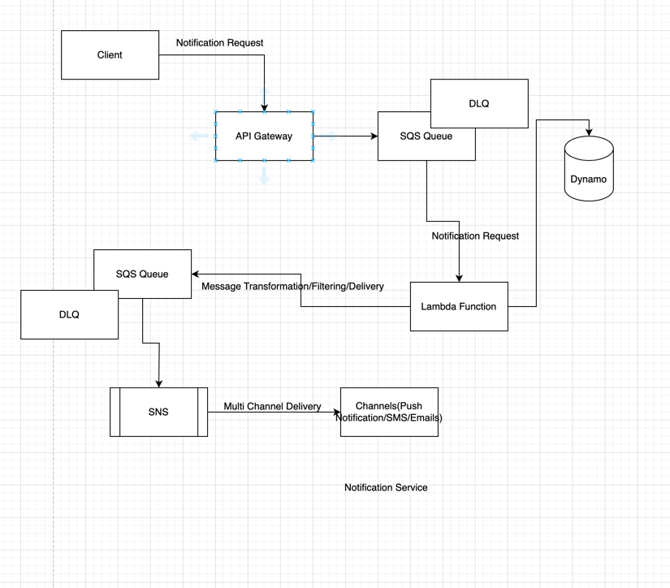

Functional Requirements:
1. Serverless Architecture to build notification service
2. sends personalised notifications to users
3. exactly once delivery 

Non-Functional Requirements:
1. High Scalability for high traffic
2. should handle througput of 500 requests per second
